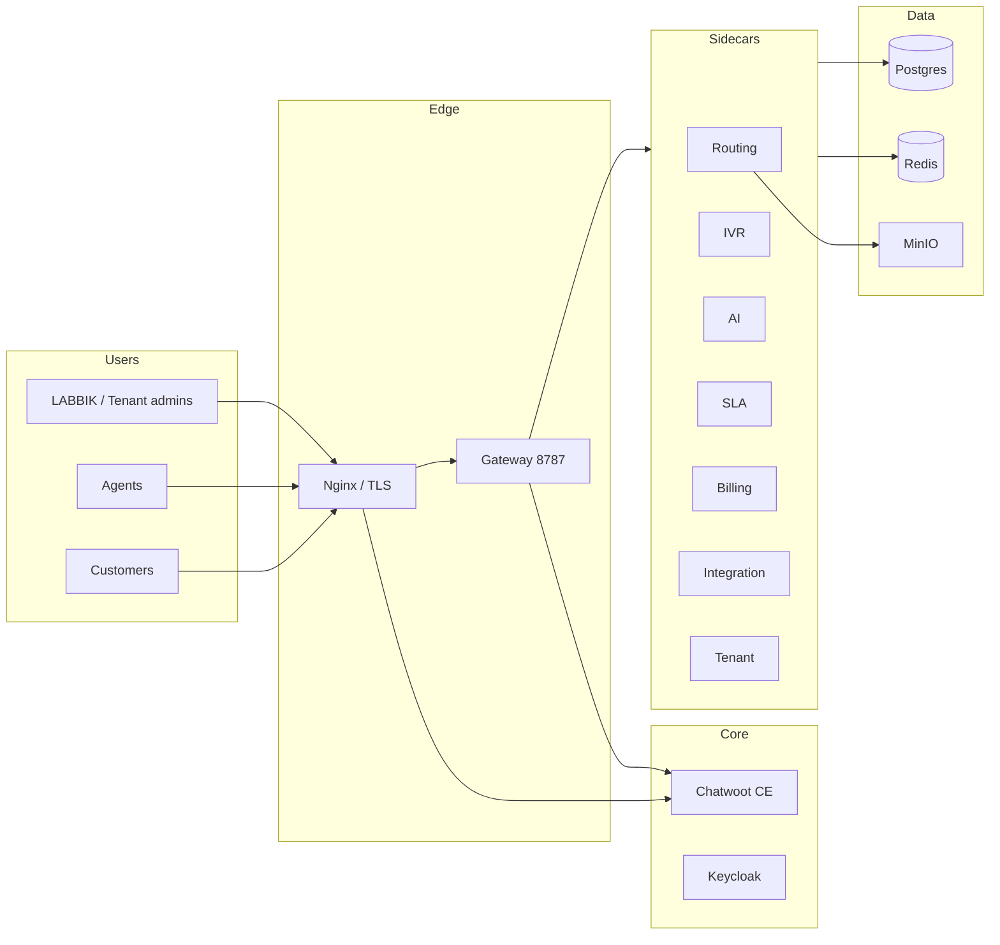

# BlinkOne architecture overview

## System context

## Container map (docker compose)

| Service | Port | Role |
|---------|------|------|
| gateway | 8787 | JWT, RBAC, reverse proxy |
| chatwoot | 3000 | Omnichannel inbox |
| routing | 8798 | ACD, queues, supervise |
| ivr | 8795 | Call flows |
| ai | 8793 | LLM, STT, TTS, RAG |
| sla | 8796 | Policies, breach worker |
| billing | 8794 | Usage, invoices |
| integration | 8800 | Webhooks, SSO, audit |
| tenant | 8802 | Provision, branding |
| postgres_app | 5432 | Shared app DB |
| redis | 6379 | Cache, event bus |
| blinkone-keycloak | 8080 | IdP broker |

## Multi-tenancy

- **Gateway** mints JWT with `tenant_id`.
- **Postgres RLS** on tenant-scoped tables (`app.tenant_id` session var).
- **Redis keys** prefixed `t:{tenantId}:`.

See [PROMPT8.md](./PROMPT8.md) and [PROMPT8_RLS_REVIEW.md](./PROMPT8_RLS_REVIEW.md).

## Event bus

Redis Stream `blinkone:events` — producers: integration (Chatwoot webhooks), sidecars. Consumers: outbound webhooks, connectors, SLA/escalation (via gateway fan-out).

Catalog: [EVENT_CATALOG.md](./EVENT_CATALOG.md).
