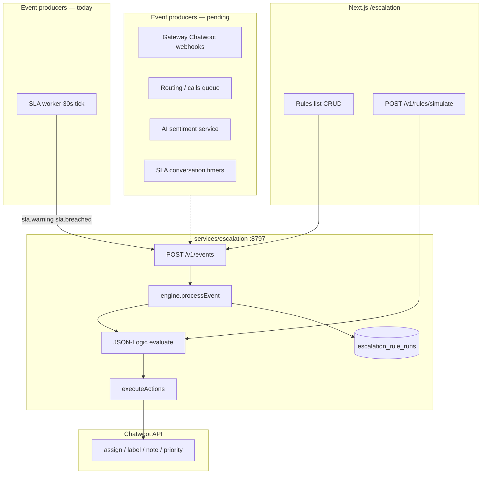

# TR-24 Escalation Rules — Gap Analysis & Acceptance Checklist

**Document:** LABBIK / BlinkOne Phase 3  
**TR IDs:** TR-24 (primary), TR-23 (SLA event producer), TR-40 (tenant-scoped workflows)  
**ADR:** [006-sla-escalation.md](./adrs/006-sla-escalation.md)  
**Last updated:** 2026-06-07  
**Overall status:** **IN PROGRESS** (~65% TR-24 core; production UI + API live)

---

## 1. Executive summary

BlinkOne implements **TR-24 Escalation rules** as a dedicated MIT sidecar (`services/escalation`, port **8797**), not Chatwoot Enterprise. The rule engine, Postgres schema, admin UI, dry-run simulator, and SLA-driven triggers are **implemented and deployed**. Several TRD items remain **partial or pending**: non-SLA event producers, full action parity, run-history UI, rule edit/delete UX, Redis event bus, and end-to-end acceptance tests against live Chatwoot.

| Area | Status |
|------|--------|
| Data model + migrations | ✅ Done |
| CRUD API (rulesets + rules) | ✅ Mostly done (PATCH added) |
| JSON-Logic conditions + simulate | ✅ Done |
| Admin UI (`/escalation`) | ✅ Done (live API) |
| Feature flag + plan gating | ✅ Done |
| SLA → escalation events | ✅ Done (worker) |
| Call / conversation timer events | ❌ Not wired |
| Sentiment / AI events | ❌ Not wired |
| Gateway Chatwoot fan-out → escalation | ❌ Not wired (SLA only) |
| Run history / incidents UI | ❌ Not built |
| Full integration tests (live actions) | ⚠️ Partial |

---

## 2. TRD requirement mapping

| TRD item | Requirement (summary) | Implementation | Status |
|----------|----------------------|----------------|--------|
| **TR-24** | Configurable escalation rules | `services/escalation`, `frontend/src/components/escalation/` | **IN PROGRESS** |
| **TR-23** | SLA breach/warning detection | `services/sla` worker → `POST /v1/events` | ✅ Done |
| **TR-40** | Per-tenant workflows | `tenant_id` on rulesets + RLS + `tenant_features.escalation` | ✅ Done |
| **TR-42** | Plan entitlements | `business`/`enterprise` include `escalation: true` | ✅ Done |
| **TR-47** | Outbound webhooks on events | `send_webhook` action only; no bus fan-out | ⚠️ Partial |
| **TR-57** | Immutable audit | `escalation_rule_runs` table (write-only today) | ⚠️ Partial |
| **TR-56** | RBAC | Gateway: `workflows.view` / `workflows.edit` | ✅ Done |

**Phase (LABBIK TRD):** Phase 3 — SLA timers, escalation rules, breach detection.

---

## 3. International standards alignment

BlinkOne escalation is designed to support common contact-center / ITSM practices. This is **conceptual alignment**, not a certified compliance claim.

| Framework / practice | TR-24 coverage in BlinkOne |
|---------------------|----------------------------|
| **ITIL 4** — escalation paths (functional / hierarchical) | Rules reassign to team/agent, bump priority, supervisor notify |
| **ISO/IEC 20000** — SLA monitoring + escalation procedures | TR-23 worker + TR-24 rules on `sla.warning` / `sla.breached` |
| **COPC / WFM** — queue abandon, long wait | Triggers defined (`call.long_wait`, `call.abandoned_in_queue`); **producers not wired** |
| **Safe rule evaluation** | Whitelisted JSON-Logic subset (`json-logic-safe.js`); no arbitrary code execution |

---

## 4. Architecture (as built)



---

## 5. Done ✅

### 5.1 Backend (`services/escalation`)

| Item | Evidence |
|------|----------|
| Postgres schema | `db/001_escalation.sql` — rulesets, rules, rule_runs |
| Tenant RLS | `db/003_rls.sql` |
| 7 whitelisted triggers | `lib/json-logic-safe.js` — `TRIGGER_WHITELIST` |
| 8 whitelisted actions | `ACTION_WHITELIST` |
| Ruleset CRUD | `GET/POST /v1/rulesets` |
| Rule CRUD | `GET/POST /v1/rulesets/:id/rules`, `PATCH /v1/rules/:id`, `PATCH /v1/rulesets/:id` |
| Dry-run | `POST /v1/rules/simulate` |
| Runtime engine | `lib/engine.js` — `processEvent`, `executeActions`, `normalizeAction` |
| Audit insert | `recordRun()` on every evaluation |
| Feature gate | `requireFeature('escalation')` + tenant service lookup |
| Health / metrics | `/healthz`, `/readyz`, Prometheus middleware |

### 5.2 SLA integration (TR-23 → TR-24)

| Item | Evidence |
|------|----------|
| Warning event | `services/sla/lib/worker.js` → `notifyEscalation(..., 'sla.warning', ...)` |
| Breach event | Same worker → `sla.breached` |
| Feature check before notify | `isFeatureEnabled(features, 'escalation')` |

### 5.3 Frontend

| Item | Evidence |
|------|----------|
| Escalation page | `frontend/src/app/(dashboard)/escalation/page.tsx` |
| Rules list + cards | `EscalationWorkspace.tsx`, `RulesetCard.tsx` |
| Condition builder | `ConditionBuilder.tsx` — 8 fields, 7 operators |
| Action display | `ActionsList.tsx` |
| New rule modal | `NewRuleModal.tsx` — trigger picker (7 triggers) |
| Dry-run panel | `DryRunPanel.tsx` |
| Live API hooks | `useEscalation.ts` — list, toggle, create, duplicate, simulate |
| Platform feature toggle | `PLATFORM_FEATURE_FLAGS` — **Escalation rules** |

### 5.4 Platform / ops

| Item | Evidence |
|------|----------|
| Gateway proxy | `/api/escalations` → escalation:8797 |
| RBAC | `workflows.view` / `workflows.edit` |
| Plan defaults | `plan-features.js` — business+ escalation on |
| Demo seed (tenant 1) | `scripts/sql/seed-demo-sla.sql` — 5 rules |
| Acceptance smoke | `tests/acceptance/tests/tr-23-sla-escalation.mjs` — simulate only |

---

## 6. Partial ⚠️

| Gap | Detail | Impact |
|-----|--------|--------|
| **Action execution** | PROMPT6 notes “Action stubs”; `notify_slack` needs `webhook_url` not `#channel`; team_id must be numeric Chatwoot team ID | Rules save but some actions skip at runtime |
| **Event payload enrichment** | SLA worker sends `conversation_id` only; conditions use `conversation.sla_tier`, `ai_sentiment`, etc. | Rich UI conditions may not match live events unless context enriched |
| **Single ruleset model** | UI loads all rulesets; create adds to “Default escalations” | OK for ops; differs from 10-ruleset demo seed (`002_seed_blinkone_rules.sql`) |
| **Edit rule UI** | `RulesetCard` has `onEdit` prop but **not wired** in workspace | Users duplicate instead of edit |
| **Delete rule** | No `DELETE` API or UI | Orphan rules manual DB only |
| **Incidents API** | Frontend `listIncidents()` calls `GET /v1/incidents`; backend only has `POST /v1/incidents` (legacy) | Run history not exposed |
| **Integration forward helper** | `integration/lib/sla-forward.js` has `forwardSlaToEscalation` but **not called** from webhook handler | Dead code path |
| **Acceptance tests** | TR-24 bundled with TR-23; tests simulate only, not live `POST /v1/events` + Chatwoot | TR-68 partial |

---

## 7. Pending ❌

| # | TR-24 expectation | Current state | Recommended fix |
|---|-------------------|---------------|-----------------|
| 1 | **Call queue events** | Triggers `call.long_wait`, `call.abandoned_in_queue` exist; **routing/calls do not POST** to escalation | Add emit in `routing` queue worker / `abandon-call.js` |
| 2 | **Conversation timers** | Triggers `conversation.unassigned_for_minutes`, `conversation.no_response_for_minutes` defined; **no timer worker** | SLA or integration timer job (Phase 3 completion) |
| 3 | **Sentiment / AI escalation** | UI conditions support `ai_sentiment`; **no `ai.sentiment_negative` trigger** or producer | AI service posts event after classify; optional new trigger |
| 4 | **Gateway webhook fan-out** | Gateway fans Chatwoot → **SLA only** (`gateway/src/index.js`); not escalation | Optional direct fan-out or keep SLA-worker chain |
| 5 | **Redis event bus** | ADR-005 / ARCHITECTURE — `blinkone:events` stream | Phase 3+ — escalation as consumer |
| 6 | **Run history UI** | Table `escalation_rule_runs` populated; **no GET API / UI** | `GET /v1/runs?rule_id=` + “History” tab on rule card |
| 7 | **Rule priority / ordering** | Removed invalid `priority` column ref; sorts by name | Add `priority INT` if TRD requires ordered execution |
| 8 | **OpenAPI / TR-46** | Escalation paths in ADR summary only | Add to aggregated OpenAPI in Phase 10 |
| 9 | **E2E Chatwoot verification** | Actions call `chatwoot-actions.js` when IDs present | Acceptance test: breach → label visible in conversation |
| 10 | **Arabic / RTL escalation UI** | TR-64/65 | i18n pass on `/escalation` |

---

## 8. Acceptance checklist (TR-24)

Use this for Phase 3 sign-off. Mark **Pass** only when verified in staging/production.

### 8.1 Configuration

- [x] Platform admin can enable `escalation` per tenant (feature flag UI)
- [x] Business plan tenants get escalation enabled by default
- [x] Escalation service returns 403 when feature disabled
- [x] Rules persist in Postgres per tenant
- [x] Supervisor can edit existing rule (not only duplicate)
- [ ] Supervisor can delete rule

### 8.2 Rule engine

- [x] JSON-Logic AND/OR conditions evaluate correctly (dry-run)
- [x] Inactive rule skipped at runtime (dry-run shows “inactive, skipped”)
- [x] Whitelist rejects unknown triggers/actions on create
- [ ] All 7 triggers have at least one production event producer
- [ ] Rule execution order documented and tested (priority)

### 8.3 Event pipeline

- [x] SLA warning posts to escalation (`sla.warning`) with enriched `conversation.sla_tier` / `sla_status`
- [x] SLA breach posts to escalation (`sla.breached`) with enriched context
- [ ] Chatwoot conversation_created updates SLA instance (integration path)
- [x] Call abandon emits `call.abandoned_in_queue` (`routing/lib/abandon-call.js`)
- [x] Long queue wait emits `call.long_wait` (`routing/lib/escalation-events.js`, queue worker)
- [ ] Unassigned / no-reply timers emit conversation.* events

### 8.4 Actions

- [x] `add_label` executes via Chatwoot API (when account + conversation IDs present)
- [x] `change_priority` executes via Chatwoot API
- [x] `post_internal_note` executes via Chatwoot API
- [x] `reassign_to_team` / `reassign_to_agent` (numeric IDs required)
- [ ] `notify_slack` — map `#channel` → tenant-configured webhook URL
- [ ] `send_webhook` — signed outbound (TR-47 `X-Blinkone-Signature`)
- [ ] `bump_queue_priority` — routing service integration

### 8.5 Observability & audit

- [x] Each run inserted into `escalation_rule_runs`
- [x] GET API for run history (`GET /v1/runs`, `/v1/run-stats`)
- [x] UI shows last fired / fired count on rule card
- [ ] Metrics: rules_matched_total, actions_executed_total (Prometheus)
- [ ] Alert on escalation action failure rate (TR-53)

### 8.6 Security & tenancy

- [x] Tenant isolation on rulesets/rules (RLS)
- [x] Gateway JWT + RBAC on `/api/escalations`
- [x] Service token for SLA → escalation internal calls
- [ ] Cross-tenant gauntlet test passes for escalation tables

### 8.7 Automated tests

- [x] Acceptance: `/v1/rules/simulate` returns `conditionsPassed: true`
- [ ] Acceptance: SLA breach → escalation run row created
- [ ] Acceptance: `add_label` visible in Chatwoot conversation
- [ ] Property tests for JSON-Logic edge cases (PROMPT6 step 10)

---

## 9. Priority roadmap (recommended)

| Priority | Work item | Effort | Phase |
|----------|-----------|--------|-------|
| **P0** | Wire `routing` abandon + long-wait → `POST /v1/events` | 1–2 d | 3 | ✅ Done |
| **P0** | Enrich SLA escalation payload (`conversation.sla_tier`, `sla_status`) | 0.5 d | 3 | ✅ Done |
| **P1** | Edit rule modal + `PATCH` wiring in UI | 1 d | 3 | ✅ Done |
| **P1** | `GET /v1/runs` + run history panel | 1–2 d | 3 | ✅ Done |
| **P1** | Conversation unassigned / no-reply timer worker | 2–3 d | 3 |
| **P2** | AI sentiment → escalation event | 1 d | 5 |
| **P2** | Slack notify — tenant webhook config | 1 d | 3 |
| **P2** | Delete rule API + UI | 0.5 d | 3 |
| **P3** | Redis event bus consumer | 3–5 d | 5+ |
| **P3** | Full TR-24 E2E acceptance suite | 2 d | 11 |

---

## 10. Production notes (2026-06-07)

Fixes applied during dynamic escalation rollout:

1. **`TENANT_TOKEN` missing** on escalation container — added to `docker-compose.yml`; feature check was always failing with 403.
2. **Platform UI** — added **Escalation rules** feature flag toggle.
3. **Tenant 1 seed** — `seed-demo-sla.sql` applied (5 rules under “Default escalations”).
4. **Frontend** — live API only (no silent demo fallback in production).

**Verify:**

```bash
# Rulesets (service token + tenant header)
curl -s -H "Authorization: Bearer $ESCALATION_TOKEN" \
  -H "x-blinkone-tenant-id: 1" \
  http://127.0.0.1:8797/v1/rulesets
```

---

## 11. Related documents

| Doc | Purpose |
|-----|---------|
| [TRD_MATRIX.md](./TRD_MATRIX.md) | Full TR-01–TR-73 traceability |
| [FEATURE_FLAGS.md](./FEATURE_FLAGS.md) | `escalation` key + plan matrix |
| [EVENT_CATALOG.md](./EVENT_CATALOG.md) | `sla.breached` consumer = escalation |
| [PROMPT6.md](./PROMPT6.md) | Implementation prompt + deploy steps |
| [STEP_07_escalation.md](../frontend/CURSOR_STEPS/STEP_07_escalation.md) | UI acceptance spec |

---

## 12. Sign-off recommendation

**TR-24 cannot be marked DONE** until at minimum:

1. P0 event producers (call + enriched SLA context) are wired.  
2. P1 edit + run history are available to supervisors.  
3. At least one E2E test proves breach → action → Chatwoot side effect.

Until then, status remains **IN PROGRESS** with core admin + simulate + SLA breach path **production-ready**.
