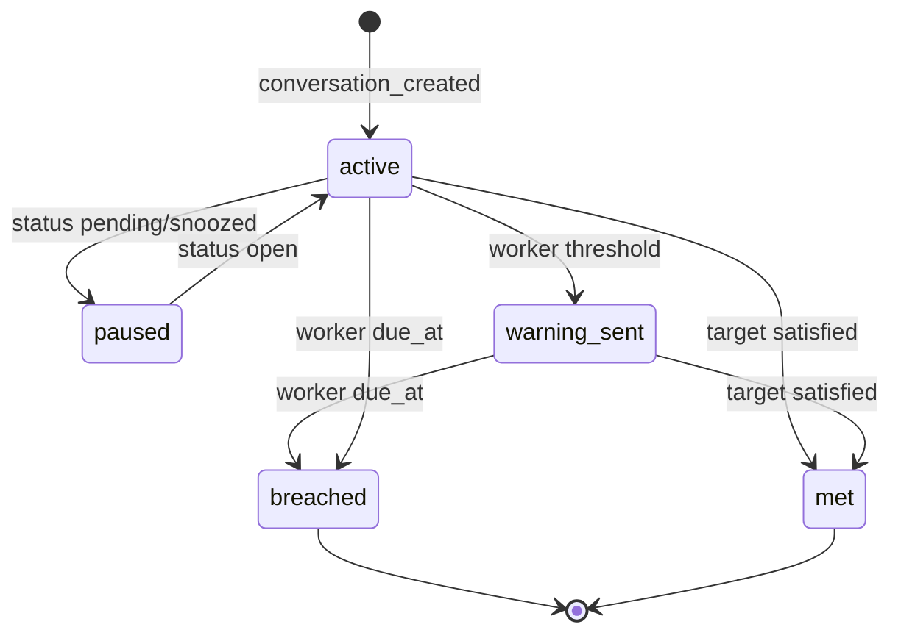

# ADR 006 — SLA + Escalation sidecars (Prompt 6)

## Context

Chatwoot Enterprise SLA is not used. BlinkOne implements TR-23 (SLA) and TR-24 (escalation) as MIT sidecars with Postgres + Redis.

## Data model (Postgres)

See `services/sla/db/001_sla.sql` and `services/escalation/db/001_escalation.sql`.

## SLA instance state

## OpenAPI (summary)

### SLA `services/sla`

| Method | Path | Description |
|--------|------|-------------|
| GET/POST | `/v1/policies` | List/create policies |
| GET/PATCH/DELETE | `/v1/policies/{id}` | Policy CRUD |
| GET/POST | `/v1/policies/{id}/targets` | Targets |
| GET/POST/PATCH | `/v1/calendars` | Business hours |
| GET | `/v1/conversations/{id}/sla` | Instances for conversation |
| POST | `/v1/sla/recalculate` | Admin rebuild |
| POST | `/v1/events` | Chatwoot fan-out events |

### Escalation `services/escalation`

| Method | Path | Description |
|--------|------|-------------|
| GET/POST | `/v1/rulesets` | Rulesets |
| GET/POST/PATCH | `/v1/rulesets/{id}/rules` | Rules |
| POST | `/v1/rules/simulate` | Dry-run JSON-Logic |
| POST | `/v1/events` | `sla.warning`, `sla.breached`, etc. |

## Implementation order

1. This ADR + SQL ✅
2. WorkingTime + property tests ✅
3. SLA CRUD + instance engine + worker
4. Chatwoot Settings UI
5. Escalation CRUD + simulate + actions stub
